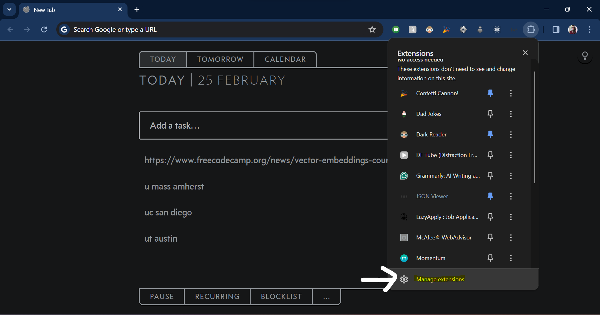
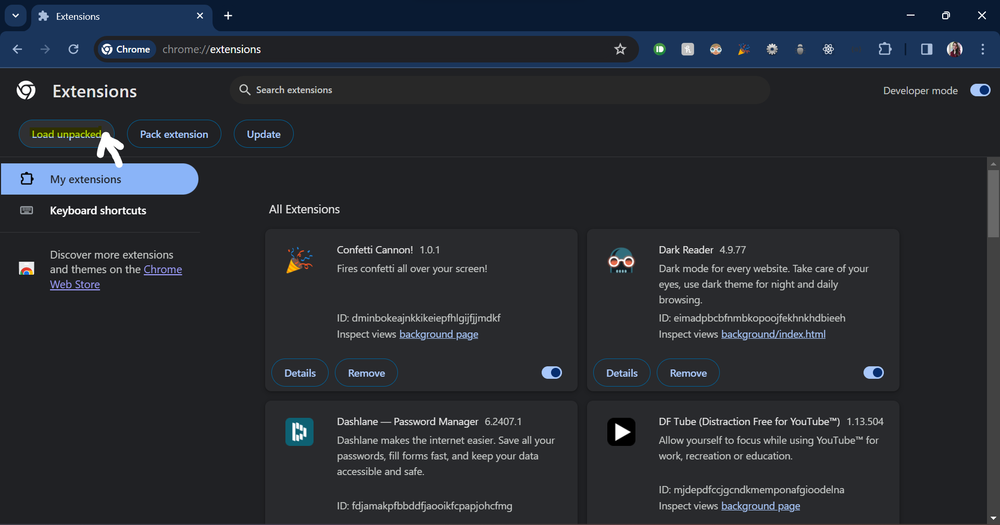
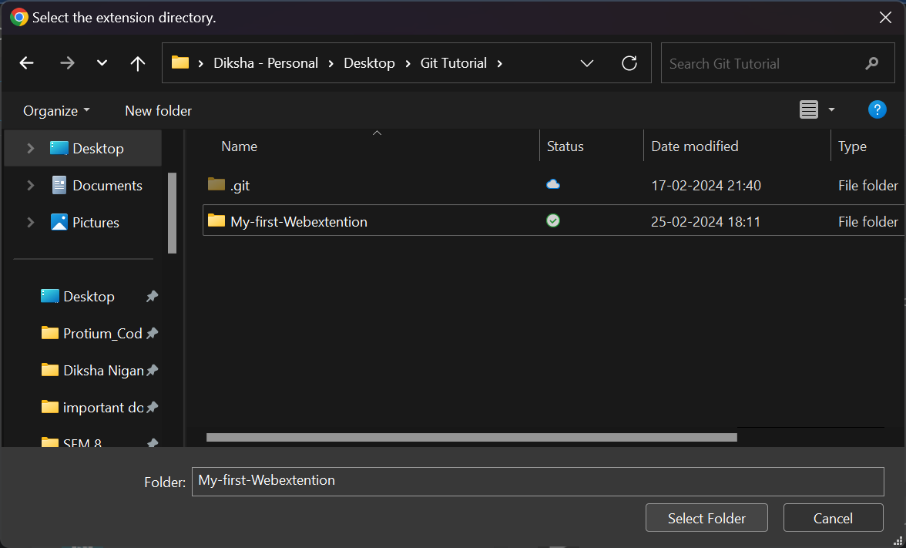
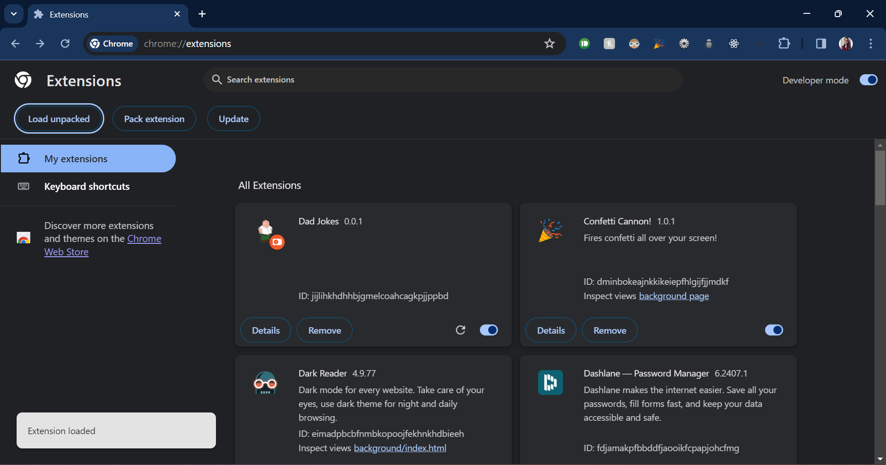
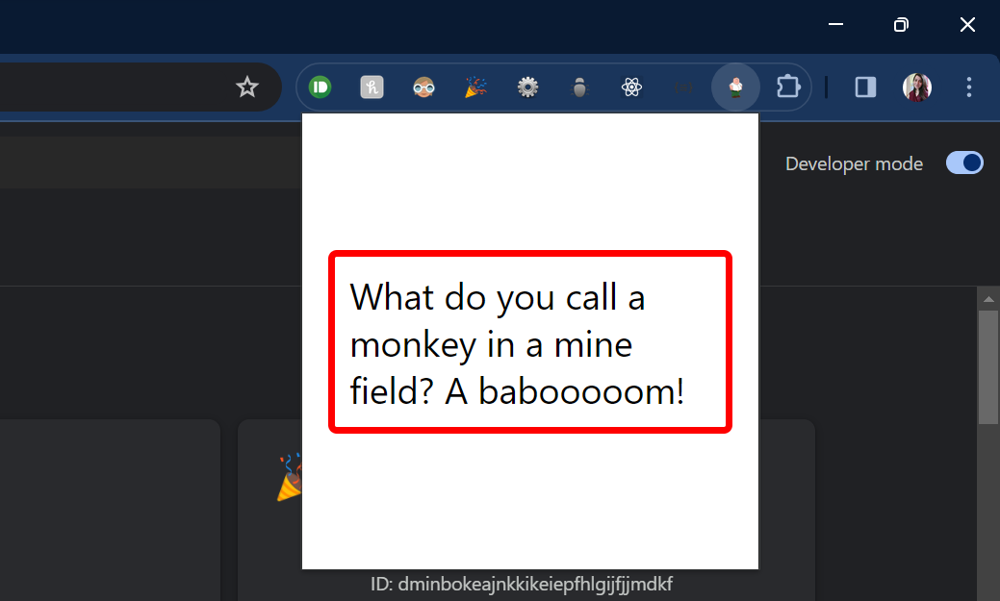

# My First Web-extension
# Dad Jokes 🙃
&nbsp;
## How to use
### 1. Clone the project in your local directory
``` git clone https://github.com/PratikMurari/My-first-Webextention.git ```

### 2. Navigate to Extensions > Manage extensions page in chrome


### 3. Click on Load unpacked button on top left corner


### 4. Select the cloned project folder


### 5. Extension is added to chrome


### 6. Your Dad jokes extension is ready to be used 😀
